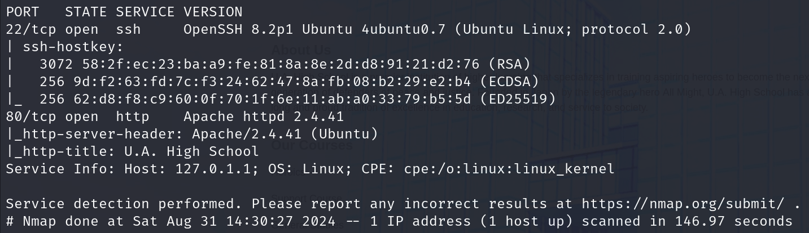

# **U.A. High School**

**Author**: Hakal  
**Title**: U.A. High School Official v4  
**Level**: Easy  

---

## **1. Introduction**

U.A. High School began by discovering a `PHP` file on the web application and fuzzing to identify parameter names. Upon finding a parameter that allowed us to run commands, we utilized it to obtain a shell. While enumerating the file system within the shell, we discovered a passphrase and a corrupted image. Fixing the image by changing the magic bytes from `PNG` to `JPG` and using the passphrase to extract the hidden data from the image, provided us with user credentials. After getting a shell as this user using `SSH`, we were able to execute a script as the root user using sudo. The script contained an arbitrary file write vulnerability, which we exploited to gain a shell as the `root` user.

---

## **2. Initial Enumeration**

<-text->

### **Step 1: Network Mapper**

O primeiro passo foi executar um Network Scan para enumerar serviços. Com isso, conseguimos saber quais serviços estão disponíveis para ataque.

Executamos o seguinte comando:

```bash
nmap -T5 -Pn -sCV -p- $ip
```

**Saída:**



As we can see, there are two ports open.

22/SSH
80/HTTP

---

### **Step 2: Content Discovery**

Depois de saber os serviços disponíveis, a próxima etapa foi encontrar recursos que podem ser utilizados como vetores de ataque. Para isso, utilizamos o [FeroxBuster](https://github.com/epi052/feroxbuster).

Utilizamos o seguinte comando:

```bash
feroxbuster -u http://$ip/ -w /usr/share/seclists/Discovery/Web-Content/common.txt -t150
```
A wordlist utilizada é essa: https://github.com/danielmiessler/SecLists

**Saída:**


**Análise:**

- Os status codes (404, 403, 200, 301) indicam as respostas do servidor para diferentes requisições:
  - **404 (Not Found):** indica que a página requisitada não existe.
  - **403 (Forbidden):** significa que o acesso ao recurso é proibido.
  - **200 (OK):** indica que a página ou recurso foi encontrado com sucesso.
  - **301 (Moved Permanently):** sugere que o recurso foi movido para outra URL.

- **Recursos descobertos**:
  - `/assets/`: parece ser um diretório com recursos estáticos (como imagens, CSS, etc.).
  - `/assets/index.php`: um possível arquivo `PHP` que pode ser alvo de análise mais profunda, já que pode conter vulnerabilidades de execução de código ou falhas em validação de entrada.
  - O servidor retorna muitos 404 e 403, que estão sendo filtrados automaticamente pela ferramenta.

- **Próximos passos sugeridos**:
  - Explorar os arquivos `PHP` encontrados, já que eles podem conter vulnerabilidades de inclusão de arquivo, execução de código remoto ou outras falhas.
  - Analisar os redirecionamentos 301 para verificar se há novos caminhos a serem explorados.
  - Verificar se há permissões incorretas em diretórios retornando 403.

---

## **4. File Exploitation**

### **Visiting the File:**


### **Análise**:

- A página acessada `http://10.10.35.53/assets/index.php` não exibe nenhum conteúdo visível, o que pode indicar várias possibilidades:

### 1. Conteúdo Condicional:
   - O arquivo `index.php` pode estar configurado para exibir conteúdo apenas sob certas condições, como parâmetros GET ou POST específicos.
   - Pode ser que a página esteja esperando:
     - **Parâmetros na URL**: Tente enviar variáveis adicionais na URL, por exemplo, `?id=1` ou outros valores, para verificar se o conteúdo é alterado dinamicamente.
     - **Autenticação**: É possível que o conteúdo só seja exibido após login ou envio de cookies específicos de sessão.
     - **Validação de Requisições**: Algumas páginas PHP processam dados com base em valores enviados via POST ou cabeçalhos HTTP personalizados.

### 2. Vulnerabilidades Potenciais:
   - Mesmo que a página não exiba conteúdo visível, o arquivo PHP pode conter vulnerabilidades que podem ser exploradas:
     - **Injeção SQL (SQLi)**: Se o `index.php` processa entradas de usuário (como parâmetros GET/POST), vale a pena testar por injeções SQL tentando incluir caracteres especiais (ex: `' OR '1'='1`).
     - **Inclusão de Arquivo Local/Remoto (LFI/RFI)**: O arquivo PHP pode estar vulnerável a inclusão de arquivos, permitindo acesso a outros arquivos no servidor. Tente enviar parâmetros como `?file=../../etc/passwd` ou `?page=login`.
     - **Execução Remota de Código (RCE)**: Se o arquivo permite inputs que são processados sem validação, pode haver uma possibilidade de executar comandos no servidor. Teste inputs que podem gerar execuções de código no sistema.
     - **Cross-Site Scripting (XSS)**: Se o arquivo PHP processa entradas sem sanitização, é possível injetar scripts JavaScript maliciosos que podem ser executados quando outros usuários acessarem a página.
   
### Próximos Passos:
- Usar ferramentas de *fuzzing* para testar diferentes inputs e identificar respostas ocultas do servidor.
- Verificar se há vulnerabilidades como injeção de SQL, LFI/RFI, RCE ou XSS.
- Testar parâmetros GET e POST para tentar interações e visualizar possíveis conteúdos dinâmicos.
- Analisar os headers HTTP e possíveis cookies de sessão para verificar dependência de autenticação ou tokens.
  
## **5. Fuzzing Parametrs**
Para fazer o fuzzing vamos unir duas wordlists pequenas em uma só e validar LFI e RCE de uma vez, uma das wordlists que vamos utilizar é:
[RCE](https://github.com/lutfumertceylan/top25-parameter?tab=readme-ov-file#top-25-remote-code-execution-rce-parameters-get-based)
E a outra é: [LFI](https://github.com/lutfumertceylan/top25-parameter?tab=readme-ov-file#top-25-local-file-inclusion-lfi-parameters)

Unindo ambas vmaos conseguir validar parameters de LFI e RCE ao mesmo tempo. Desta forma executamos o seguinte comando:

```bash
ffuf -u "http://$ip/assets/index.phpFUZZls" -w lfi-rce.txt -fs 0
```
Lembrando que a wordlist utilizada é a união das duas acimas, o nome pode ser qualquer um. Lembre-se de remover o `=` no final de cada palavra, para que facilite mais a sua visualização.

**Saída:**


### **Análise**:

- A ferramenta utilizada aqui é o *ffuf* (Fuzz Faster U Fool), que está sendo usada para testar possíveis parâmetros e valores no endpoint `http://10.10.35.53/assets/index.phpFUZZ=ls`. O objetivo é verificar se o arquivo `index.php` é vulnerável a Local File Inclusion (LFI) ou execução remota de código (RCE).

### 2. Resultados:
   - O fuzzing retornou um status **200 OK** para o parâmetro testado, sugerindo que a requisição foi processada com sucesso pelo servidor.
   - O tamanho da resposta foi **40 bytes**, mas contém apenas **1 palavra** e **1 linha**, o que pode indicar uma resposta mínima, possivelmente sem conteúdo significativo visível, ou apenas uma confirmação de execução sem retornar dados.

### 3. Possibilidades:
   - **Execução de Comandos Remotos (RCE)**: O `=ls` no final da URL indica uma tentativa de executar o comando `ls` (listar diretórios). Se a palavra `ls` foi de fato executada, pode haver uma vulnerabilidade de execução de código remoto (RCE), onde comandos arbitrários são executados no servidor.
   - **Resposta Curta**: O tamanho da resposta sugere que, mesmo que o comando tenha sido aceito, pode ser que o resultado não tenha sido exibido ou foi minimamente renderizado. Isso pode acontecer devido à filtragem de saída no código PHP ou outras limitações de visualização no frontend.

### Próximos Passos:
- **Analisar a resposta**: Embora o status seja 200, a resposta curta pode indicar que o servidor processou o comando, mas não exibiu a saída. Isso requer uma análise mais detalhada da resposta para entender o comportamento.
- **Testar outros comandos**: Pode ser útil testar comandos adicionais que possam retornar dados mais facilmente interpretáveis, como `cat /etc/passwd`, para verificar se a inclusão de arquivos ou execução remota de código é possível.

---

## **5. Exploiting RCE**

### **Requisitando o parâmetro:**


## Análise:

- A URL acessada foi `http://10.10.35.53/assets/index.php?cmd=ls`, e a resposta retornada foi a seguinte string codificada em Base64:
  


### 1. Decodificação da Resposta:

- Para tentar decodificar essa string Base64, podemos Utilizamos o seguinte comando:

```bash
echo 'aW1hZ2VzCmluZGV4LnBocApzdHlsZXMuY3NzCg==' | base64 -d
```

**Saída:**


### 2. Análise do Conteúdo Decodificado:

- O comando enviado (`ls`) foi processado pelo servidor, e o resultado da execução foi codificado em Base64 e retornado. A saída contém a lista de arquivos e diretórios presentes no diretório atual do servidor.

- Os itens retornados são:
- **images/**: Um diretório contendo, provavelmente, arquivos de imagem usados pelo site.
- **index.php**: O arquivo PHP que está sendo explorado.
- **styles.css**: Um arquivo de folha de estilo (CSS), usado para definir o layout da página.

### 3. Comportamento do Sistema:

- O fato de a saída ser codificada em Base64 sugere que o código PHP que processa o comando provavelmente está sanitizando ou modificando a saída antes de retorná-la. Isso pode ser uma medida para ocultar diretamente a saída do comando ou evitar caracteres especiais na resposta.

### 4. Próximos Passos:

- **Testar novos comandos**: Agora que a execução de comandos foi confirmada, podemos tentar obter uma reverse shell.

---
## **5. Reverse Shell as www-data**

Sabendo que nossos comandos são interpretados sem problema, apenas voltam encodados como base64, podemos tentar obter uma shell reversa. Para isso vamos utilizar a seguinte [projeto](https://www.revshells.com/).


A ferramenta é bem intuitiva, basta preencher seu ip da VPN do TryHackMe e a porta que vamos utilizar. Como o RCE é via Web, vamos encodar para URL encode. Testando os comandos disponíveis o que funcionou pra mim foi esse:


Não se esqueça de abrir o listening indicado no site na porta que você recebeu.


Agora basta substituir o comando dentro do parâmetro que encontramos.


Dito isso, agora devemos ter recebido uma shell reversa.


---
## **6. Acessando todo conteúdo do Site**

Agora que temos acesso total ao sistema podemos acessar e visualizar todo conteúdo que não conseguimos enumerar, para entender mais a aplicação e sua finalidade.

Enumerando o diretório que a shell é aberta conseguimos ver um diretório chamado `images` e nele há um conteúdo que supostamente é usado pelo site, mas vamos entender como e onde.


Acessando o primeiro arquivo pelo navegador, já conseguimos notar algumas inconsistências.


### 1. Possíveis Motivos do Erro:

1. **Arquivo Corrompido**:
 - O arquivo de imagem `oneforall.jpg` pode estar corrompido ou incompleto, o que impede sua renderização correta pelo navegador.

2. **Formato Incorreto**:
 - Apesar da extensão `.jpg`, o navegador está identificando o arquivo como `PNG`, resultando em um erro ao tentar exibi-lo.

3. **Problemas de Codificação**:
 - É possível que o servidor tenha problemas com a codificação ou compressão do arquivo, tornando-o ilegível pelo cliente (navegador).

### 2. Próximos Passos:

- **Alterar assinatura de arquivo**:
- Use comandos como `hexyl oneforall.jpg` ou `hexeditor oneforall.jpg` para verificar a integridade do arquivo e o formato correto.

---
## **7. Ajustando Assinatura de Arquivo**

Para essa etapa vamos fazer o download do arquivo na nossa máquina e analisar a integridade do arquivo.

O download pode ser executado via wget sem problemas, dado que as iamgens estão hospedadas e acessiveis no servidor web, ou seja, na porta 80. Sendo assim, podemos Utilizamos o seguinte comando:

```bash
wget http://10.10.56.94/assets/images/oneforall.jpg
```

**Saída:**


Agora que o arquivo foi carregado na nossa máquina, vamos abrir o `hexeditor` para visualizar às assinaturas.

```bash
hexeditor oneforall.jpg
```

O `hexeditor` vai abrir uma tela mostrando todos hexdaecimais do arquivo.


Observando a primeira linha conseguimos visualizar os números da assinatura do arquivo `PNG`. Sabendo disso podemos tentar modificar a assinatura do arquivo para que ele volte a ser um `.jpg` como diz sua extensão. Para isso vamos utilizar essa lista do  e procurar qual a assinatura para arquivos `JPG`


Agora vamos modificar os hexidacimais para os números encontrados na lista. Que são:

```text
FF D8 FF E0 00 10 4A 46 49 46 00 01
```


Agora só salvat com CTRL +X e Enter para confirmar o nome do arquivo.

Após essa alteração, vamos verificar se o arquivo pode ser aberto ou exibido na nossa máquina.


## Análise:

### 1. Modificação da Assinatura do Arquivo:
- O arquivo original parecia estar corrompido pois tinha assinatura de `PNG`, mas era um `JPEG`. Para corrigir isso, você utilizou um **hexeditor** para alterar a assinatura do arquivo para **JPEG**.
- Você alterou essa assinatura para que o arquivo fosse interpretado como **JPEG**, permitindo sua abertura.

### 2. Comando `file`:
- O comando `file oneforall.jpg` confirma que, após a modificação, o arquivo agora é tratado como:

```text
JPEG image data, JFIF standard 1.01, aspect ratio, density 1x1, segment length 16, baseline, precision 8, 1140x570, components 3
```

- **JFIF**: Indica que o arquivo agora está no formato JPEG.
- **1140x570**: Dimensões da imagem.
- **Components 3**: A imagem tem 3 componentes de cor (RGB), típico de uma imagem JPEG.

### 3. Possibilidade de Dados Ocultos:
- **Presença de Esteganografia**: Como de costume quando há modificações nesse nível e imagens sem uma devida utilização, existe a possibilidade de estar relacionada a uma técnica possível usada aqui pode ser **esteganografia**, onde dados são embutidos em arquivos de imagem, mas não são visíveis ao usuário comum.

- **Indícios de Esteganografia**:
  - A modificação da assinatura de PNG para JPEG sugere que o arquivo original pode ter sido alterado para ocultar dados.
  - O uso de um **hexeditor** também pode indicar que, além de alterar a assinatura, dados maliciosos ou ocultos foram inseridos em partes específicas do arquivo.
  - Verifique por padrões incomuns nos dados hexadecimal que não correspondem a uma imagem normal.

## **8. Extração Esteganográfica**

Para validar se o arquivo possui algum arquivo oculto confirmar os indícios identificados acima, podemos usar a ferramenta `steghide`, que caso você não possua, pode visitar o [projeto](https://salsa.debian.org/pkg-security-team/steghide).

Sabendo disso vamos usar o comando preenchendo uma **senha vazia**:

```bash
steghide extract -sf oneforall.jpg
```

**Saída:**


Infelizmente não conseguimos extrair nada sem utilizar uma senha específica, tentei por mais algumas vezes, mas sem sucesso. Dessa forma, vamos voltar a shell reversa e enumerar mais para tentar encontrar algo que nos leve a essa senha.

Voltando a shell fiz uma enumeração básica voltando diretórios e lendo todos os arquivos ali presentes em busca de algo que indicasse uma senha. Felizmente encontrei o diretório `Hidden_Content` com o arquivo `passphrase.txt`


Agora, fazendo a leitura desse arquivo obtemos um conteúdo codificado com `Base64`, mas como visto anteriormente, podemos fazer o decode de forma simples e fácil.


```bash
echo 'QWxsbWlnaHRGb3JFdmVyISEhCg==' | base64 -d
```

**Saída:**


Agora com a senha, podemos tentar ler novamente aquele mesmo conteúdo que foi escondido na imagem `oneforall.jpg`, desta forma vamos executar o mesmo comando que usamos anteriormente ```bash steghide extract -sf oneforall.jpg``` porém com a senha: `AllmightForEver!!!`.


Como podemos ver nós obtivemos acesso a um arquivo que contém um usuário e uma senha separados por um delimitador `:`. Isso indica que podemos tentar acessar esse usuário com essas credenciais no serviço `SSH` que enumeramos na primeira etapa.

## **9. Acessando conta de usuário via SSH**

Sabendo que temos o serviço `SSH` aberto, um usuário e senha, vamos tentar acessar o serviço com as credenciais de usuário. Caso você não saiba o que é `SSH` recomendo que leia esse [artigo](https://www.cloudflare.com/learning/access-management/what-is-ssh/).

Dito isso, vamos usar o seguinte comando:

```bash
ssh deku@$ip
```

Sendo `deku` o usuário que conseguimos enumerar e `$ip` o alvo que estamos atacando.

**Saída:**


Agora autenticado como o usuário, nós temos acesso ao diretório e consequentemente a primeira flag.


Autenticado e com a senha do usuário podemos enumerar os privilégios concedidos a esse usuário, para isso vamos usar o comando `sudo -l` e inserir a senha do usuário.


# Análise da Saída do Comando `sudo -l`

Na saída do comando `sudo -l`, temos as permissões de superusuário (root) concedidas ao usuário "deku". Abaixo está a explicação detalhada de cada parte:

## 1. Privilégios Padrão (Defaults)
```bash
Matching Defaults entries for deku on myheroacademia:
  env_reset, mail_badpass, secure_path=/usr/local/sbin\:/usr/local/bin\:/usr/sbin\:/usr/bin\:/sbin\:/bin\:/snap/bin
```

### Significado:
- **`env_reset`**: Limpa e redefine o ambiente ao usar `sudo`, garantindo que apenas um conjunto seguro de variáveis de ambiente seja utilizado. Isso ajuda a prevenir ataques baseados em variáveis de ambiente.
- **`mail_badpass`**: Caso uma senha errada seja fornecida ao executar um comando com `sudo`, um email é enviado ao administrador do sistema.
- **`secure_path`**: Define o caminho seguro que o `sudo` utiliza ao procurar por executáveis. Os diretórios listados são `/usr/local/sbin`, `/usr/local/bin`, `/usr/sbin`, `/usr/bin`, `/sbin`, `/bin`, e `/snap/bin`.

## 2. Comandos Permitidos
```bash
User deku may run the following commands on myheroacademia:
  (ALL) /opt/NewComponent/feedback.sh
```

### Significado:
- O usuário **"deku"** tem permissão para rodar **qualquer comando** (`ALL`) como root ao executar o script localizado em `/opt/NewComponent/feedback.sh`.

## Implicações de Segurança:
- O script **`/opt/NewComponent/feedback.sh`** pode ser executado com privilégios de root. Isso pode ser perigoso, dependendo do conteúdo do script.
- Se o script for mal projetado ou vulnerável, pode haver uma **possibilidade de exploração**, como injeção de comandos, que pode permitir ao usuário "deku" obter acesso de superusuário (root) completo.

## Possível Vetor de Ataque:
- **Escalada de Privilégios**: Se houver vulnerabilidades no script `feedback.sh`, como falta de validação de entrada, o usuário "deku" pode potencialmente explorar essas falhas para ganhar acesso root ao sistema.

Sendo assim, vamos tentar obter uma shell como root.

---
## **10. Privilege Escalation**

Sabendo do risco que citamos acima, vamos analisar no detalhe o que o código faz e como podemos utilizar disso para escalar nosso privilégio.


# Análise de código:

1. Boas-vindas e Instruções

bash

echo "Hello, Welcome to the Report Form"
echo "This is a way to report various problems"
echo "  Developed by"
echo "  The Technical Department of U.A."

    Aqui, o script exibe uma mensagem de boas-vindas e algumas instruções para o usuário. Isso não apresenta problemas ou falhas aparentes.

2. Leitura do Feedback

bash

echo "Enter your feedback:"
read feedback

    O script solicita que o usuário insira um feedback, que será armazenado na variável $feedback.

3. Validação do Feedback

bash

if [[ "$feedback" != *"\`"* && "$feedback" != *"("* && "$feedback" != *"{"* && "$feedback" != *"}"* && "$feedback" != *"?"* && "$feedback" != *"!"* && "$feedback" != *"\\"* ]]; then
    echo "It is This:"
    eval "echo $feedback"

    Aqui há uma série de validações no feedback:
        O feedback não pode conter certos caracteres como:
            Crase (```)
            Parênteses (( e ))
            Chaves ({ e })
            Ponto de interrogação (?)
            Ponto de exclamação (!)
            Barra invertida (\\)

    Essas verificações têm o objetivo de evitar a execução de comandos ou injeções de código através da entrada do usuário, o que pode mitigar alguns tipos de ataques.

    No entanto, a parte problemática é o uso do eval. Eval é perigoso, pois avalia e executa o que é passado a ele. Mesmo com as restrições de caracteres, o uso do eval é uma prática arriscada, pois um invasor pode encontrar maneiras de escapar das verificações ou explorar outros elementos para executar código arbitrário.

4. Gravação do Feedback

bash

    echo "$feedback" >> /var/log/feedback.txt
    echo "Feedback successfully saved."

    O feedback é salvo em um arquivo de log em /var/log/feedback.txt. Esta parte do código está funcional, mas pode gerar problemas de permissão, já que o diretório /var/log normalmente requer permissões administrativas para gravação.

5. Tratamento de Entrada Inválida

bash

else
    echo "Invalid input. Please provide a valid input."
fi

    Caso o feedback contenha algum dos caracteres proibidos, o script exibe uma mensagem de erro e não salva o feedback.

Pontos de Vulnerabilidade e Melhorias:

    Uso de eval: Mesmo com algumas verificações, o uso de eval deve ser evitado a todo custo, pois permite a execução de código arbitrário. Uma maneira mais segura seria simplesmente exibir o valor do feedback sem o uso de eval, como por exemplo:

    bash

    echo "$feedback"

    Melhoria na Validação: A lista de caracteres proibidos cobre alguns casos, mas não todos. Seria mais seguro utilizar funções como grep para garantir que o feedback não contenha comandos perigosos, ou simplesmente evitar o uso de eval.

    Gravação em Diretórios Seguros: A gravação diretamente no diretório /var/log pode falhar em ambientes sem permissões administrativas. Talvez o script devesse salvar o feedback em um diretório onde o usuário tenha permissões de escrita.

Resumo:

O script coleta o feedback do usuário, valida contra alguns caracteres perigosos e o salva em um arquivo de log. Porém, o uso de eval pode ser explorado, mesmo com a validação atual, e há riscos relacionados à gravação de arquivos. O código seria muito mais seguro se evitasse o eval e melhorasse as verificações de entrada do usuário.

Luckily, neither `>` nor `/` are one of the restricted characters, sendo assim podemos utilizar esse caracteres para escrever arquivos e escalar privilégios na máquina.
---
Método 1: Adicionando usuário no /etc/sudoers


Análise:

1. Execução do Script com sudo

    O usuário executa o script feedback.sh com privilégios de sudo:

    bash

    sudo /opt/NewComponent/feedback.sh

    Isso dá ao script permissões de administrador, permitindo que ele faça alterações no sistema que exigiriam privilégios elevados.

2. Entrada Maliciosa

    O usuário insere o seguinte texto como feedback:

    bash

    deku ALL=NOPASSWD: ALL >> /etc/sudoers

    Esse comando está formatado de uma maneira que permite a edição do arquivo /etc/sudoers. Através da vulnerabilidade no script, que usa eval, a entrada é tratada como um comando, resultando na adição da linha deku ALL=NOPASSWD: ALL ao arquivo /etc/sudoers.

    Impacto: Essa linha concede ao usuário deku permissão para executar qualquer comando com sudo sem ser solicitado pela senha, efetivamente dando a ele acesso root irrestrito.

3. Execução com Sucesso

    O script confirma que o feedback foi "salvo com sucesso". Isso significa que o comando foi executado e a entrada foi escrita no arquivo /etc/sudoers, o que configura um backdoor para o usuário deku.

4. Elevação de Privilégios

    O usuário então utiliza o comando sudo su:

    bash

    sudo su

    Graças à modificação no arquivo /etc/sudoers, o usuário deku agora pode se tornar root sem precisar fornecer uma senha, como mostrado pelo prompt que mudou de deku@myheroacademia para root@myheroacademia.

Resumo

O que aconteceu aqui foi uma exploração de uma vulnerabilidade de execução de comandos (Command Injection). O uso imprudente de eval no script permitiu que o usuário inserisse comandos maliciosos como parte do "feedback", resultando na modificação do arquivo crítico /etc/sudoers, o que concedeu privilégios de root ao usuário deku.
---
Método 2: Adicionando chave ssh no /root/.ssh/authorized_keys

Nesse passo existem duas etapas, um é gerar a chave ssh na sua máquina caso você não tenha, você pode usar o `ssh-keygen` para isso.


Agora o próximo passo é injetar isso no script.


Agora é só efetuar um ssh para a máquina utilizando o usuário root.


--
Método 3: Adicionando novo usuário no /etc/passwd

Neste passo vamos ter mais de uma etapa também, mas são tão simples quanto o anterior.

A primeira etapa é gerar uma senha com  o comando mkpasswd. Vamos passar alguns argumentos como -m md5crypt: Esse argumento especifica o algoritmo de hashing que será usado para gerar a senha. Nesse caso, o algoritmo escolhido é o MD5Crypt, que é uma variante do algoritmo MD5, adaptada para gerar hashes mais seguros para senhas, implementando técnicas de "salting" (adição de dados aleatórios) e múltiplas iterações para dificultar ataques de força bruta.

    -s: Essa opção indica que o mkpasswd deve solicitar a senha de forma segura (escondendo os caracteres da senha enquanto ela é digitada), sem passar a senha diretamente no comando, o que evita que ela fique exposta em logs ou na lista de processos do sistema.

Em resumo, o comando mkpasswd -m md5crypt -s solicita ao usuário que insira uma senha (de forma segura, sem exibi-la) e gera um hash criptografado dessa senha usando o algoritmo MD5Crypt.


No caso acima, eu gerei essa hash para a senha `123`

Perfeito, agora tendo a senha em mãos vamos ajustar para o formato esperado dentro do arquivo /etc/passwd.

```bash
hakal:$1$Dhk.lMO1$nJeZfbQNSMUbSRAwkNzuk0:0:0:hakal:/root:/bin/bash
````

Que no caso ficaria como o exemplo acima, sendo, usuário, senha, números de uid e gid e caminho para o root. Isso significa que o usuário que vamos criar estará no mesmo grupo do root e utilizando a mesma pasta.

Na hora de injetar no código we use ' around what we want to write due to the $ character in the password hash.


Feita a injeção, agora temos um usuário com às mesmas permissões de root com a senha que definimos e o nome que definimos.
---

## **11. Conclusão**

Indepentende do método utilizado, vamos conseguir obter a flag de root.


