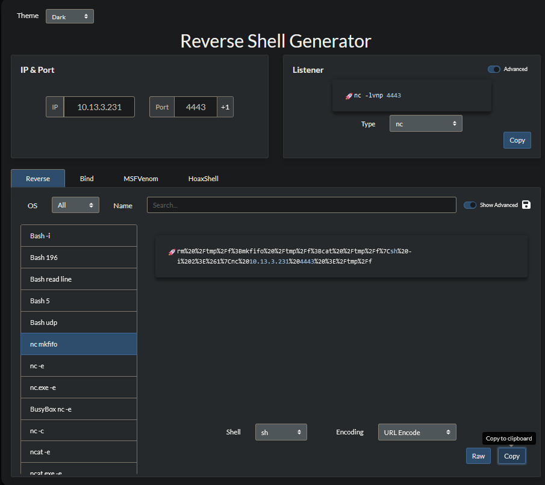

# **U.A. High School**

**Author**: Hakal  
**Title**: U.A. High School Official v4  
**Level**: Easy  

---

## **1. Introduction**

In this walkthrough, we explore the U.A. High School challenge, which involves exploiting a web application to gain unauthorized access. We begin by discovering a `PHP` file on the web application and perform fuzzing to identify potential parameter names. Upon finding a parameter that allows us to execute commands, we utilize it to obtain a shell on the server. While enumerating the file system within the shell, we discover a passphrase and a corrupted image file. By correcting the image's magic bytes from `PNG` to `JPG` and using the passphrase to extract hidden data from the image, we obtain user credentials. Using `SSH`, we access the server as this user. Finally, we exploit a script with an arbitrary file write vulnerability to escalate our privileges and gain root access.

---

## **2. Initial Enumeration**

### **Step 1: Network Scanning with Nmap**

The first step is to perform a network scan to enumerate the services running on the target machine. This allows us to identify which services are available for potential exploitation.

We execute the following command:

```bash
nmap -T5 -Pn -sCV -p- $ip
```

**Explanation of the Command:**

- `nmap`: Network Mapper, a tool used for network discovery and security auditing.
- `-T5`: Sets the timing template to 'Insane', making the scan as fast as possible.
- `-Pn`: Treats all hosts as online; skips host discovery.
- `-sCV`: Performs service version detection (`-sV`) and runs default scripts (`-sC`).
- `-p-`: Scans all 65,535 TCP ports.
- `$ip`: The IP address of the target machine.

**Output:**


**Analysis:**

As we can see, there are two open ports on the target machine:

- **Port 22 (SSH)**: Used for secure remote login.
- **Port 80 (HTTP)**: Hosts the web server.

---

### **Step 2: Content Discovery with Feroxbuster**

After identifying the available services, the next step is to find resources that can be used as attack vectors. We use [Feroxbuster](https://github.com/epi052/feroxbuster) for content discovery.

We use the following command:

```bash
feroxbuster -u http://$ip/ -w /usr/share/seclists/Discovery/Web-Content/common.txt -t150
```

**Explanation of the Command:**

- `feroxbuster`: A tool for recursive content discovery.
- `-u http://$ip/`: Specifies the target URL.
- `-w /usr/share/seclists/Discovery/Web-Content/common.txt`: Uses a common wordlist from [SecLists](https://github.com/danielmiessler/SecLists).
- `-t150`: Sets the number of threads to 150 for faster scanning.

**Output:**


**Analysis:**

- **HTTP Status Codes:**

  - **404 (Not Found)**: The requested resource does not exist.
  - **403 (Forbidden)**: Access to the resource is denied.
  - **200 (OK)**: The resource was found successfully.
  - **301 (Moved Permanently)**: The resource has been moved to a different URL.

- **Discovered Resources:**

  - `/assets/`: Likely contains static resources such as images, CSS, or JavaScript files.
  - `/assets/index.php`: A PHP file that could be analyzed for vulnerabilities.

- **Next Steps:**

  - **Explore PHP Files:** Investigate the PHP files for vulnerabilities like Remote Code Execution (RCE) or Local File Inclusion (LFI).
  - **Analyze Redirects:** Follow 301 redirects to discover additional paths.
  - **Investigate Forbidden Directories:** Examine directories returning 403 errors for potential misconfigurations.

---

## **3. File Exploration**

### **Accessing the PHP File**

We navigate to the PHP file at `http://$ip/assets/index.php`.


**Analysis:**

- **No Visible Content:** The page does not display any visible content, which could indicate:

  1. **Conditional Content Rendering:**
     - The page may require specific GET or POST parameters to display content.
  2. **Authentication Requirements:**
     - The page might be accessible only after authentication or with certain session cookies.
  3. **Input Validation:**
     - The script could be processing data based on user inputs sent via POST requests or custom HTTP headers.

- **Potential Vulnerabilities:**

  - **SQL Injection (SQLi):** The script may be vulnerable if it processes inputs without proper sanitization.
  - **File Inclusion (LFI/RFI):** Inclusion of files based on user input could allow access to sensitive files.
  - **Remote Code Execution (RCE):** Improper input handling may allow execution of arbitrary commands.
  - **Cross-Site Scripting (XSS):** Unsanitized inputs might enable injection of malicious scripts.

**Next Steps:**

- **Fuzzing:** Use fuzzing tools to test different inputs and parameters.
- **Vulnerability Testing:** Check for SQLi, LFI/RFI, RCE, and XSS vulnerabilities.
- **Parameter Exploration:** Experiment with various GET and POST parameters.
- **Session Analysis:** Inspect HTTP headers and cookies for authentication mechanisms.

---

## **4. Fuzzing Parameters**

To discover potential parameters accepted by the `index.php` script, we combine two wordlists focused on LFI and RCE parameters.

**Wordlists Used:**

- [Top 25 Remote Code Execution (RCE) Parameters](https://github.com/lutfumertceylan/top25-parameter#top-25-remote-code-execution-rce-parameters-get-based)
- [Top 25 Local File Inclusion (LFI) Parameters](https://github.com/lutfumertceylan/top25-parameter#top-25-local-file-inclusion-lfi-parameters)

We merge both wordlists into a single file named `lfi-rce.txt`, ensuring we remove any trailing `=` signs for clarity.

We execute the following command:

```bash
ffuf -u "http://$ip/assets/index.phpFUZZ=ls" -w lfi-rce.txt -fs 0
```

**Explanation of the Command:**

- `ffuf`: Fuzz Faster U Fool, a web fuzzer.
- `-u "http://$ip/assets/index.phpFUZZ=ls"`: Specifies the target URL with `FUZZ` as the placeholder for the parameter names.
- `-w lfi-rce.txt`: Uses the combined wordlist.
- `-fs 0`: Filters out responses with a size of 0 bytes.

**Output:**


**Analysis:**

- **Positive Response:** The server responded with a `200 OK` status for one of the parameters, indicating successful processing.
- **Response Size:** The response size was minimal, suggesting that the parameter may be valid but not producing significant output.
- **Potential Entry Point:** This parameter could be exploited to test for RCE or LFI vulnerabilities.

---

## **5. Exploiting Remote Code Execution**

### **Testing the Parameter**

We test the parameter by executing the `ls` command via the URL:

```
http://$ip/assets/index.php?cmd=ls
```


**Server Response:**

The server returns a Base64-encoded string:


**Decoding the Response**

We decode the Base64 string to reveal the command output:

```bash
echo 'aW1hZ2VzCmluZGV4LnBocApzdHlsZXMuY3NzCg==' | base64 -d
```

**Decoded Output:**


- The decoded output lists the contents of the current directory:

  ```
  images
  index.php
  styles.css
  ```

**Analysis:**

- **Command Execution Confirmed:** The server executes the `ls` command and returns the output encoded in Base64.
- **Output Encoding:** The use of Base64 encoding may be an attempt to sanitize or obscure the output.
- **Vulnerability Present:** The ability to execute arbitrary commands indicates an RCE vulnerability.

**Next Steps:**

- **Obtain Reverse Shell:** Leverage the RCE vulnerability to gain a shell on the server.
- **Maintain Persistence:** Establish a more stable connection for further enumeration.

---

## **6. Obtaining a Reverse Shell as www-data**

Given that command execution is possible, we aim to establish a reverse shell using an online tool.

**Using RevShells:**

We utilize [RevShells](https://www.revshells.com/) to generate a reverse shell payload suitable for web-based RCE.


**Steps:**

1. **Configure Payload:**
   - Enter our VPN IP address and a listening port.
   - Select an appropriate payload and encode it using URL encoding.
   - The payload that worked is:

     

2. **Set Up Listener:**
   - Start a Netcat listener on the chosen port:

     ```bash
     nc -lvnp <port>
     ```

     

3. **Execute Payload:**
   - Insert the payload into the `cmd` parameter in the URL:

     ```
     http://$ip/assets/index.php?cmd=<payload>
     ```

     

4. **Receive Shell:**
   - Upon accessing the URL, a reverse shell is established:

     

**Result:**

- We gain shell access as the `www-data` user, allowing us to explore the server further.

---

## **7. Exploring the Web Server Content**

With shell access, we examine the file system to understand the application and look for sensitive information.

**Directory Enumeration:**

- We list the contents of the current directory and find a directory named `images`:

  

**Accessing Files via Browser:**

- We attempt to view the files in the `images` directory through the web browser:

  

**Analysis:**

- **Rendering Error:** The image fails to display correctly.
- **Possible Causes:**

  1. **Corrupted File:** The image file may be corrupted or incomplete.
  2. **Incorrect File Format:** The file extension may not match the actual file format.
  3. **Encoding Issues:** There may be issues with file encoding or compression.

**Next Steps:**

- **Analyze File Integrity:** Download the file for further analysis using a hex editor.
- **Check File Signatures:** Verify the file's magic bytes to confirm its format.

---

## **8. Adjusting the File Signature**

To inspect the file's integrity, we download it to our local machine.

**Downloading the File:**

```bash
wget http://$ip/assets/images/oneforall.jpg
```


**Analyzing with Hex Editor:**

- We open the file using `hexeditor`:

  ```bash
  hexeditor oneforall.jpg
  ```

  

**Observation:**

- **Incorrect Magic Bytes:** The file starts with `PNG` signature bytes (`89 50 4E 47`), but has a `.jpg` extension.
- **Magic Bytes Correction:** We refer to [Wikipedia's List of File Signatures](https://en.wikipedia.org/wiki/List_of_file_signatures) to find the correct signature for JPEG files:

  ```
  FF D8 FF E0 00 10 4A 46 49 46 00 01
  ```

**Modifying the File:**

- We replace the initial bytes with the correct JPEG signature:

  

- Save the file after modifications.

**Verifying the File:**

- We check the file type:

  ```bash
  file oneforall.jpg
  ```

  

**Result:**

- The file is now recognized as a JPEG image and can be opened normally.

**Analysis:**

- **Intentional Alteration:** The mismatch suggests the file may contain hidden data.
- **Potential Steganography:** We suspect that data may be concealed within the image.

---

## **9. Extracting Hidden Data**

To confirm our suspicion of hidden data, we use `steghide` to attempt extraction.

**First Attempt Without Passphrase:**

```bash
steghide extract -sf oneforall.jpg
```


- **Result:** Extraction fails due to the absence of a passphrase.

**Searching for the Passphrase:**

- We return to the reverse shell and search for clues.
- In the directory `Hidden_Content`, we find `passphrase.txt`:

  

**Reading the Passphrase File:**

- The file contains a Base64-encoded string:

  

**Decoding the Passphrase:**

```bash
echo 'QWxsbWlnaHRGb3JFdmVyISEhCg==' | base64 -d
```

**Decoded Passphrase:**


- **Passphrase:** `AllmightForEver!!!`

**Extracting Data with Passphrase:**

- We attempt extraction again using the passphrase:

  ```bash
  steghide extract -sf oneforall.jpg
  ```

  

- **Result:** Successfully extracted a file containing a username and password.

**Next Steps:**

- **SSH Access:** Use the credentials to log in via SSH.

---

## **10. Accessing the User Account via SSH**

We attempt to access the SSH service using the extracted credentials.

**SSH Connection:**

```bash
ssh deku@$ip
```


**Authentication:**

- Enter the password obtained from the hidden data.

**Result:**

- Successfully logged in as user `deku`.

  

**Privilege Enumeration:**

- Check for sudo privileges:

  ```bash
  sudo -l
  ```

  

**Analysis of `sudo -l` Output:**

- **User `deku` can run:**

  ```bash
  (ALL) /opt/NewComponent/feedback.sh
  ```

- **Implication:** The user can execute the script `feedback.sh` with root privileges.

**Next Steps:**

- **Script Analysis:** Examine the script for potential vulnerabilities that could allow privilege escalation.

---

## **11. Privilege Escalation**

### **Analyzing the Script**

We inspect the content of `/opt/NewComponent/feedback.sh`.


**Script Overview:**

- **User Interaction:** The script prompts the user for feedback.
- **Input Validation:** It checks for prohibited characters: `` ` ``, `(`, `{`, `}`, `?`, `!`, `\`.
- **Execution of Input:** Uses `eval` to echo the feedback.
- **Logging:** Appends the feedback to `/var/log/feedback.txt`.

**Vulnerability Identified:**

- **Use of `eval`:** Dangerous when used with user input, even with some characters restricted.
- **Command Injection Possibility:** The lack of restriction on certain characters (`>`, `/`) allows for command injection.

**Exploitation Method 1: Modifying `/etc/sudoers`**

**Steps:**

1. **Run the Script with Sudo:**

   ```bash
   sudo /opt/NewComponent/feedback.sh
   ```

2. **Provide Malicious Input:**

   - Input:

     ```
     deku ALL=NOPASSWD: ALL >> /etc/sudoers
     ```

     

3. **Gain Root Access:**

   - Switch to root without a password:

     ```bash
     sudo su
     ```

**Explanation:**

- **Effect:** Adds an entry to `/etc/sudoers`, granting `deku` passwordless sudo access.
- **Result:** Full root privileges obtained.

---

**Exploitation Method 2: Adding SSH Key to Root's Authorized Keys**

**Steps:**

1. **Generate SSH Key Pair:**

   - If not already available, generate with `ssh-keygen`.

     

2. **Inject Public Key:**

   - Provide the following input:

     ```
     echo '<your_public_key>' >> /root/.ssh/authorized_keys
     ```

     

3. **SSH as Root:**

   - Connect using the private key:

     ```bash
     ssh root@$ip
     ```

     

**Explanation:**

- **Effect:** Adds our public key to root's authorized keys, allowing SSH access.
- **Result:** Direct root login achieved.

---

**Exploitation Method 3: Adding a User to `/etc/passwd`**

**Steps:**

1. **Generate Password Hash:**

   - Use `mkpasswd`:

     ```bash
     mkpasswd -m md5crypt -s
     ```

     - Enter a password (e.g., `123`).

     

2. **Prepare Malicious Entry:**

   - Create an entry:

     ```
     hakal:$1$Dhk.lMO1$nJeZfbQNSMUbSRAwkNzuk0:0:0:hakal:/root:/bin/bash
     ```

3. **Inject into `/etc/passwd`:**

   - Input:

     ```
     echo 'hakal:$1$Dhk.lMO1$nJeZfbQNSMUbSRAwkNzuk0:0:0:hakal:/root:/bin/bash' >> /etc/passwd
     ```

     

4. **Switch to New User:**

   - Login as `hakal` with the specified password.

**Explanation:**

- **Effect:** Creates a new user with UID `0` (root).
- **Result:** Root access via the new user.

---

## **12. Conclusion**

Regardless of the method used, we successfully escalated privileges to obtain root access and retrieved the root flag.


**Key Takeaways:**

- **Avoid Using `eval`:** Executing user input with `eval` is highly dangerous.
- **Input Validation is Crucial:** Proper sanitization and validation of user inputs are essential.
- **Secure Scripting Practices:** Scripts running with elevated privileges must be written securely.
- **Regular Audits:** Periodic security audits can help identify and mitigate vulnerabilities.

---

This concludes the detailed walkthrough of the U.A. High School challenge.
